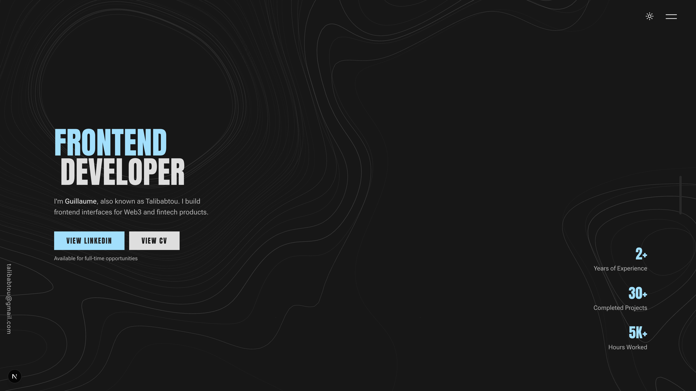

<p align="center">
  <a href="https://talibabtou.dev">
    
  </a>
</p>

# Talibabtou's Portfolio

Personal site for **Guillaume Dumas** — frontend product engineer focused on Web3, fintech, and data-heavy interfaces.

**Live:** [talibabtou.dev](https://talibabtou.dev)

## Stack

| Layer | Tools |
| --- | --- |
| Framework | [Next.js](https://nextjs.org/) 16 (App Router), [React](https://react.dev/) 19, TypeScript |
| Styling | [Tailwind CSS](https://tailwindcss.com/) 4, CSS variables in `src/app/globals.css` |
| Motion | [GSAP](https://gsap.com/) (`src/lib/gsap.ts`, section hooks) |
| Data viz / 3D | lightweight-charts, react-globe.gl, Three.js |
| Quality | Biome, ESLint, strict `pnpm run check` |
| Hosting | [Vercel](https://vercel.com/) — deploy gated by GitHub Actions |

## How it is built

The homepage is a single scroll experience composed of section components (`Banner`, `AboutMe`, `Experiences`, `Skills`, `ProjectList`, `DemoLab`). Copy, projects, and stack metadata live in **`src/lib/data.ts`**; project detail pages use the dynamic route `src/app/projects/[slug]/`.

**Demo Lab** (`src/app/_components/DemoLab.tsx`) is the technical showcase: five interactive tracks (market chart, protocol data room, world map, GitHub radar, wallet flow) registered in `demo-tracks.ts` and loaded on demand via `preload` hooks to keep the initial bundle lean.

Shared UI (navbar, cursor, page transitions, topography background) sits under `src/components/`. Animation and layout helpers are in `src/lib/` (`use-section-gsap`, `page-transition`, `topography`, etc.).

Design tokens (accent color, surfaces) are centralized in **`globals.css`** — change `--primary` to retint the whole site.

## Project layout

```text
src/
├── app/                 # routes, homepage sections, demos, project pages
├── components/          # reusable UI (navbar, footer, buttons, icons)
├── lib/                 # content data, hooks, GSAP, utilities
└── types/               # shared TypeScript types
.github/workflows/     # CI + Vercel deploy
```

## Local development

**Requirements:** Node.js 22+, [pnpm](https://pnpm.io/)

```bash
pnpm install
pnpm dev          # http://localhost:3000
```

Before opening a PR:

```bash
pnpm run check    # Biome, ESLint, typecheck, production build
```

Other scripts: `pnpm run fix` (auto-fix), `pnpm run lint`, `pnpm run typecheck`, `pnpm run build`.

## CI / deployment

Every push and PR to `main` runs parallel checks:

- Format and Biome
- ESLint
- TypeScript
- Production build
- Production smoke test (`next start` + HTTP checks on `/` and `/sitemap.xml`)

Deploy to Vercel runs **only if all checks pass**. Automatic Vercel Git deploys are disabled (`vercel.json`); GitHub Actions owns preview (PR) and production (`main`) deploys.

For local Vercel linking: `vercel link` (creates `.vercel/project.json`, gitignored).

## Contributing

Issues and PRs are welcome. Please:

1. Fork the repo and branch from `main`.
2. Keep changes scoped; match existing patterns (see `AGENTS.md` for conventions).
3. Run `pnpm run check` locally — CI must be green.
4. Use `rem` over `px` for custom sizing; put shared types/constants in `src/types/` and `src/lib/constants.ts` when reused across files.
5. Do not commit secrets (`.env.local` stays local).

## Attribution

Forked and heavily adapted from [Tajmirul Islam's portfolio](https://github.com/Tajmirul/portfolio-2.0) ([tajmirul.site](https://tajmirul.site/)). Content, demos, and direction are my own.

## License

[MIT](LICENSE) — Copyright (c) 2026 Talibabtou
